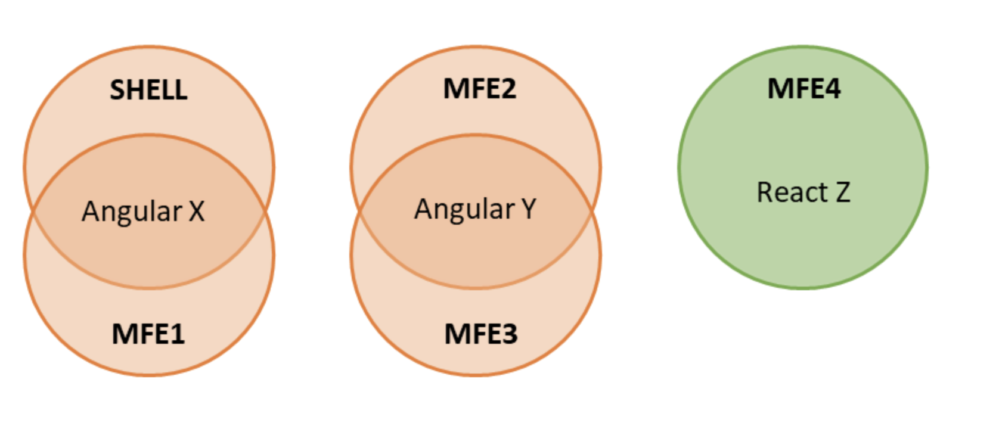

# Multi Framework(version) Micro Frontends with Module Federation and Web Components

## Conceptual Map

## Start and Run

1. ``yarn`` -- Install dependencies
2. ``yarn bootstrap`` -- Install dependencies of all micro frontends and shell with lerna
3. ``yarn start`` -- Starts the shell and all Micro Frontends with lerna
4. Navigate to ``http://localhost:4200`` to start the shell

References

- Image and code retrieved from https://www.angulararchitects.io/aktuelles/multi-framework-and-version-micro-frontends-with-module-federation-your-4-steps-guide/
